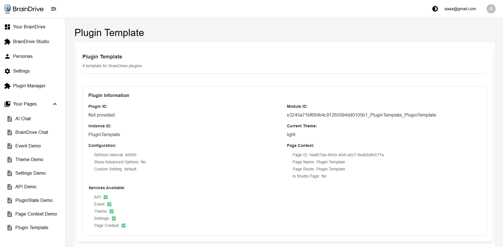

# BrainDrive Plugin Development Template

A comprehensive template for creating robust [BrainDrive](https://github.com/BrainDriveAI/BrainDrive) plugins with best-practice error handling, service integration, and component architecture. 

Gives BrainDrive Builders a solid foundation for building production-ready BrainDrive plugins.

## 📸 Plugin Demo



## 🎯 Purpose

This template serves as a **starting point** for BrainDrive plugin development, providing:
- Comprehensive error handling patterns and utilities
- Proper BrainDrive service integration
- React component architecture with error boundaries
- TypeScript type definitions and interfaces
- Development tools and debugging utilities
- Production-ready code structure and patterns

## 📦 What's Included

### Core Components

1. **Main Plugin Component** (`PluginTemplate.tsx`) - Enhanced with comprehensive error handling
2. **Error Boundary** (`ErrorBoundary.tsx`) - React error boundary with recovery mechanisms
3. **Error Display** (`ErrorDisplay.tsx`) - User-friendly error display with actions
4. **Loading Spinner** (`LoadingSpinner.tsx`) - Consistent loading state component
5. **Settings Example** (`SettingsExample.tsx`) - Template for plugin configuration

### Error Handling System
- **Custom Error Types** - Specific error classes for different scenarios
- **Error Handler Utility** - Centralized error management with multiple strategies
- **Service Integration** - Error-safe service initialization and usage
- **User Experience** - Clear error messages and recovery options

### Development Tools
- **TypeScript Definitions** - Complete type safety for BrainDrive APIs
- **Utility Functions** - Enhanced utilities with error handling
- **Documentation** - Comprehensive guides and examples
- **Testing Patterns** - Error handling test examples

## 🚀 Getting Started

### Prerequisites
- Node.js 16+ and npm/yarn
- BrainDrive development environment
- Basic knowledge of React and TypeScript

### Setup
1. **Copy the template** to your new plugin directory
2. **Customize the plugin metadata**:
   ```bash
   # Update package.json with your plugin details
   # Update lifecycle_manager.py with your plugin information and module definitions
   ```
3. **Install dependencies**:
   ```bash
   npm install
   ```
4. **Build the plugin**:
   ```bash
   npm run build
   ```

### Customization Checklist
- [ ] Update `package.json` name, description, and version
- [ ] Customize `lifecycle_manager.py` plugin and module data ([see guide](references/LIFECYCLE_MANAGER_CUSTOMIZATION_GUIDE.md))
- [ ] Replace template components with your functionality
- [ ] Update error types and handling for your use cases
- [ ] Add your specific service integrations
- [ ] Write tests for your plugin functionality

## 🔧 Template Features

### Enhanced Error Handling
- **Custom Error Types**: `PluginError`, `ServiceError`, `ValidationError`, `NetworkError`, `ConfigurationError`
- **Error Strategies**: Retry, Fallback, Ignore, Escalate, User Action
- **Error Boundaries**: React component error protection
- **User-Friendly Display**: Clear error messages with recovery options
- **Development Tools**: Enhanced debugging and error tracking

### Service Integration Patterns
- **Safe Service Initialization**: Error-protected service setup
- **Fallback Mechanisms**: Graceful degradation when services fail
- **Validation**: Input and response validation with error handling
- **Retry Logic**: Automatic retry for transient failures

### Component Architecture
- **Class-based Components**: BrainDrive-compatible React components
- **Lifecycle Management**: Proper initialization and cleanup
- **State Management**: Error-aware state handling
- **Theme Support**: Automatic theme detection and switching

## 🛠️ Development Workflow

### 1. Plugin Structure
```
src/
├── components/           # React components
│   ├── ErrorBoundary.tsx    # Error boundary component
│   ├── ErrorDisplay.tsx     # Error display component
│   └── index.ts             # Component exports
├── services/            # Business logic services
│   └── PluginService.ts     # Main service with error handling
├── utils/              # Utility functions
│   ├── errorHandling.ts     # Error handling utilities
│   └── utils.ts             # General utilities
├── types.ts            # TypeScript definitions
└── PluginTemplate.tsx  # Main plugin component
```

### 2. Error Handling Implementation
```typescript
// Initialize error handler
const errorHandler = new ErrorHandler({
  maxRetries: 3,
  retryDelay: 1000,
  enableLogging: true,
  enableReporting: true
});

// Use safe operations
const result = await errorHandler.safeAsync(
  () => riskyOperation(),
  fallbackValue,
  ErrorStrategy.RETRY
);
```

### 3. Service Integration
```typescript
// Safe service initialization
await this.errorHandler.safeAsync(async () => {
  if (services.api) {
    // Initialize API service with validation
    const response = await services.api.get('/endpoint');
    this.validateResponse(response);
  }
}, undefined, ErrorStrategy.FALLBACK);
```

### 4. Component Protection
```typescript
// Wrap components in error boundaries
<ErrorBoundary
  onError={(error, errorInfo) => console.error('Component error:', error)}
  resetOnPropsChange={true}
>
  <YourComponent />
</ErrorBoundary>
```

## 🎓 Learning Resources

### Documentation
- **[Developer Guide](DEVELOPER_GUIDE.md)** - Comprehensive implementation guide
- **[Error Handling Guide](ERROR_HANDLING_GUIDE.md)** - Detailed error handling reference
- **[Lifecycle Manager Customization Guide](references/LIFECYCLE_MANAGER_CUSTOMIZATION_GUIDE.md)** - Complete guide for customizing lifecycle_manager.py

### Lifecycle Manager References
- **[Lifecycle Manager Reference](references/Lifecycle-Manager-Reference.md)** - Complete lifecycle manager architecture and function reference
- **[Plugin Data Field Reference](references/Plugin-Data-Field-Reference.md)** - Detailed reference for all plugin_data fields
- **[Module Data Field Reference](references/Module-Data-Field-Reference.md)** - Comprehensive guide to module_data configuration

### Additional Resources
- **Inline Comments** - Extensive code documentation and TODOs

### Key Concepts
- **Error Handling Strategies** - When and how to use different error approaches
- **Service Integration** - Proper BrainDrive service usage patterns
- **Component Lifecycle** - React component patterns for BrainDrive
- **Type Safety** - TypeScript patterns for plugin development

## 🧪 Testing Your Plugin

### Development Testing
1. **Build the plugin**: `npm run build`
2. **Test error scenarios**: Simulate various error conditions
3. **Verify error handling**: Ensure proper error display and recovery
4. **Check service integration**: Test with and without services available

### Error Handling Tests
```typescript
// Example error handling test
it('should handle service failures gracefully', async () => {
  const mockService = jest.fn().mockRejectedValue(new Error('Service failed'));
  
  const result = await errorHandler.safeAsync(
    mockService,
    'fallback',
    ErrorStrategy.FALLBACK
  );
  
  expect(result).toBe('fallback');
});
```

### Integration Testing
- Test plugin loading and initialization
- Verify service integration works correctly
- Check error boundary functionality
- Validate user error experience

## 🔍 Template Architecture

### Error-First Design
- Every operation is wrapped in error handling
- User experience is prioritized during errors
- Comprehensive logging and debugging support
- Production-ready error reporting integration

### Service Integration
- Safe service initialization with fallbacks
- Proper cleanup and resource management
- Validation of service responses
- Error recovery mechanisms

### Component Patterns
- Error boundaries protect component trees
- Loading states and error states are handled consistently
- Theme integration with error handling
- Proper lifecycle management

## 🛠️ Customization Guide

### 1. Replace Template Components
```typescript
// Replace PluginTemplate.tsx with your main component
export default class YourPlugin extends React.Component {
  // Use the error handling patterns from the template
  private errorHandler = new ErrorHandler(/* your config */);
  
  // Implement your plugin logic
}
```

### 2. Add Custom Error Types
```typescript
// Create plugin-specific error types
export class YourPluginError extends PluginError {
  constructor(message: string, context?: any) {
    super(message, 'YOUR_PLUGIN_ERROR', context);
  }
}
```

### 3. Customize Service Integration
```typescript
// Add your specific service integrations
private async initializeYourServices(): Promise<void> {
  await this.errorHandler.safeAsync(async () => {
    // Your service initialization logic
  }, undefined, ErrorStrategy.RETRY);
}
```

### 4. Update Plugin Metadata
- Modify `package.json` with your plugin information
- Customize `lifecycle_manager.py` with your plugin data and module definitions
  - **See [Lifecycle Manager Customization Guide](references/LIFECYCLE_MANAGER_CUSTOMIZATION_GUIDE.md)** for detailed instructions

## 📋 Requirements

- **BrainDrive Platform**: This template is designed for BrainDrive plugins
- **Node.js 16+**: For development and building
- **TypeScript**: Template uses TypeScript for type safety
- **React**: Class-based React components for BrainDrive compatibility

## 🆘 Troubleshooting

### Common Issues
- **Build errors**: Check TypeScript types and imports
- **Service integration**: Verify BrainDrive services are available
- **Error handling**: Ensure error boundaries are properly configured

### Debug Tips
- Use the enhanced error display for debugging
- Check browser console for detailed error logs
- Use the error handler statistics for monitoring
- Enable development mode for additional debugging info

## 📚 Related Resources

- [BrainDrive](https://github.com/BrainDriveAI/BrainDrive)
- [Plugin Development Guide](DEVELOPER_GUIDE.md)
- [Error Handling Reference](ERROR_HANDLING_GUIDE.md)
- [ServiceExample_Events](../ServiceExample_Events/) - Event service demo

## 🤝 Contributing

When contributing to this template:
1. Maintain backward compatibility
2. Add comprehensive error handling to new features
3. Update documentation for any changes
4. Include tests for new functionality
5. Follow the established code patterns

## Questions?

Post at [community.braindrive.ai](https://community.braindrive.ai). We're here to build the future of user-owned AI together. 

## License

[MIT Licensed](LICENSE) - BrainDrive is built for your ownership & freedom. Your AI. Your Rules. 


